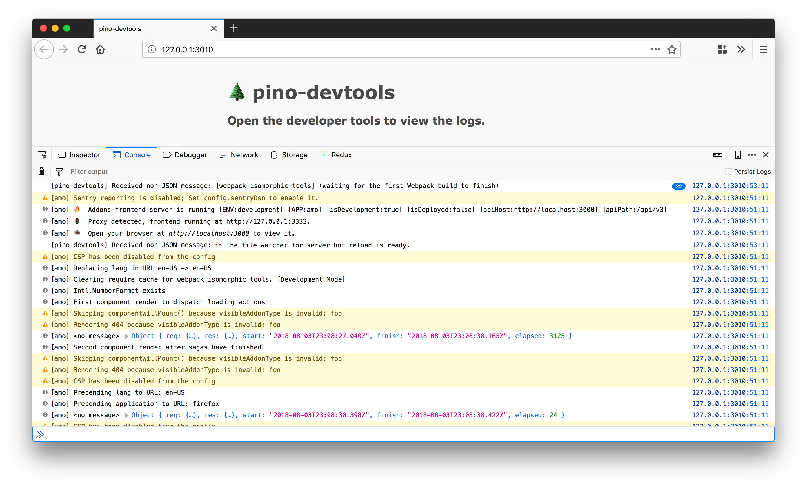

# pino-devtools

[](https://travis-ci.org/willdurand/pino-devtools)

A transport for viewing logs in your favorite browser devtools!

<p align="center"></p>

## Installation

```
$ npm i pino-devtools
```

## Usage

Given an application `your-app.js` that logs via [pino](https://www.npmjs.com/package/pino), you would use `pino-devtools` like so:

```
$ node your-app.js | pino-devtools
```

`pino-devtools` automatically opens a page in your default browser (unless `--no-open` is supplied). Open the devtools and you will see the logs coming from your application into the console tab.

### Options

- `--host 127.0.0.1`: the host for the HTTP and web socket servers
- `--port 3010`: the HTTP server port
- `--no-open`: do not automatically open the page in the browser
- `--mode websocket`: the server mode, more information in the next section

Note: the web socket port is `port + 1`.

### Server modes

The server can be started in one of these two modes:

- `websocket`: the default mode, which opens a new tab in your browser and forwards the logs _via_ a websocket. There is nothing to configure in your application
- `buffer`: a mode that does not open a new tab or use a websocket but uses a buffer to store all the logs and a client in your application to output those logs in the same console as your application

#### `buffer` mode

Use `pino-devtools` like so:

```
$ node your-app.js | pino-devtools --mode buffer
```

Update your application code to require the `pino-devtools` client and calls the `fetchBufferedLogs()` async function as early as possible:

```js
// index.js
const { fetchBufferedLogs } = require('pino-devtools/src/client');

await fetchBufferedLogs();
```

## License

pino-devtools is released under the Mozilla Public License Version 2.0. See the bundled [LICENSE](./LICENSE.txt) file for details.
